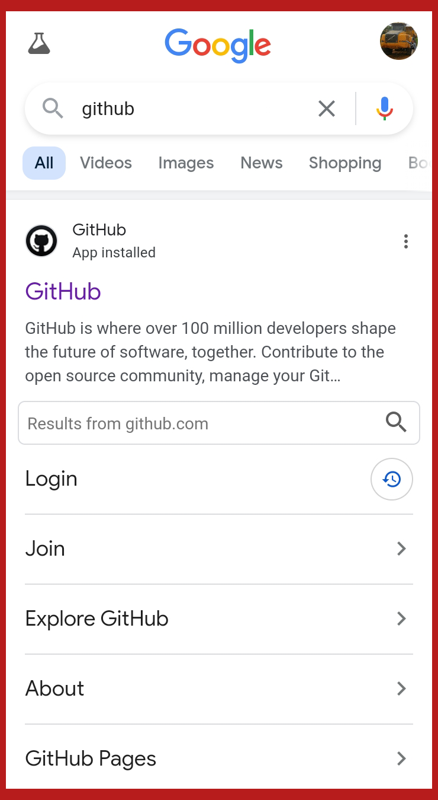

#### HORskin

Repo ini adalah contoh cara 
menggunakan interaksi server <b>github.com</b> 
menggunakan perintah git di lokal system android. 
Dengan adanya aplikasi simulasi text command 
yaitu termux, maka git dapat berjalan
dengan baik seperti menggunakan PC yg biasa
dilakukan programer di seluruh dunia

