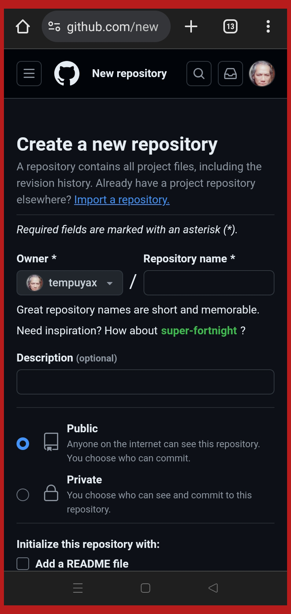
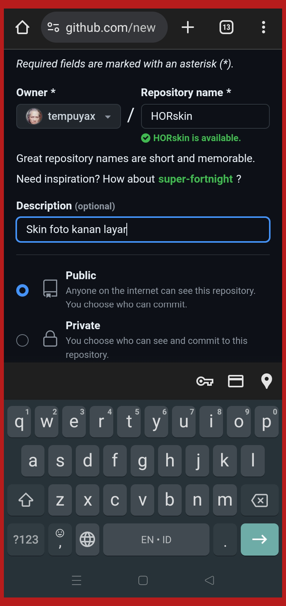
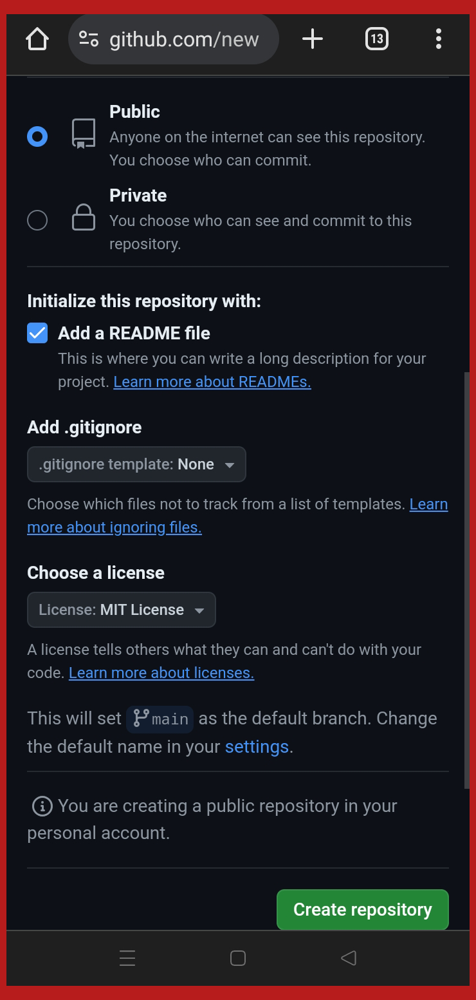
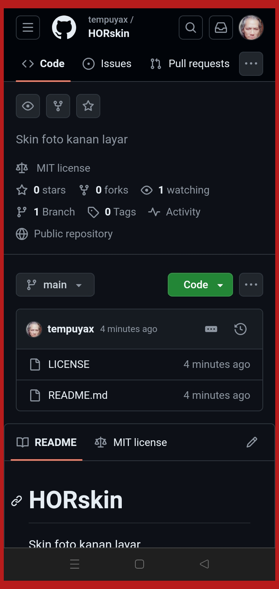

#### HORskin

```
   Editor 	: Pahor Mustaly
   Date 	: Juni 2024
```

- **Mencari github.com**
<p align=justify>
Repo ini adalah contoh cara 
menggunakan interaksi server 
<b>github.com</b> 
menggunakan perintah <b>git</b> di lokal 
<i>system android</i>. Dengan adanya aplikasi 
imulasi text command, yaitu <b><i>termux</i></b>, 
maka git dapat berjalan dengan baik, 
sama seperti menggunakan PC biasa yang
dilakukan para programer di seluruh 
dunia.
</p>


<i>(gbr.1) ScreenShoot Oppo A55</i>
<br/>
<b>Melalui google search, cari github dan pilih
untuk membuka web nya</b>
<br>

- **Membuka github.com**
<p align=justify>
Tekan kata github dari hasil pencarian dan pilih 
chrome browser di window bagian bawah.
</p>


<i>(gbr.2) ScreenShoot Oppo A55</i>
<br/>
<b>Pilih browser standar android, biasanya adalah
 chrome</b>
<br>

<p align=justify>
Abaikan jika tampilan gambar berbeda, dari sisi 
backgraund maupun status pilihan aplikasi android 
anda, intinya pilih lah yang browser. 
</p>

- **Dashboard github.com**
<p align=justify>
Diasumsikan anda sudah meregister dan mendapatkan 
akun di github.com,
maka anda akan dibawa masuk ke halaman 
<b>dashboard</b> dibawah ini.
</p>


<i>(gbr.3) ScreenShoot Oppo A55</i>
<br/>
<b>Tampilan Dashboard Github.com</b>
<br>

<p align=justify> Bagi anda sebagai akun baru, 
saat membuka GitHub tampak ada perbedaan. Pada 
gbr.3 terlihat <b>Repository</b> sudah banyak 
saya buat. </p>

- **Ke Menu Your Repositories** 
<p align=justify> Sentuh Foto 
profil sebelah kanan atas. Jika 
anda melakukan hal ini dengan 
benar, maka menu utama github 
muncul dan pilihlah <b>Your 
Repositories</b> untuk masuk 
ke halaman repo kita.</p>


<i>(gbr.4) ScreenShoot Oppo A55</i> 
<br/> 
<b> 
Sentuh pada foto akun di pojok kanan atas, 
untuk menampilkan Pilihan menu 
</b> 
<br>

- **Membuat Repo Baru** 
<p align=justify> Apa itu 
repositories??? Biar tidak salah 
faham, anggap saja Repositori itu 
sebuah <b>File Folder</b> yang 
berada di Disk PC kita. 
Perhatikan gambar di bawah ini 
utk membuat repo baru. </p>


<i>(gbr.5) ScreenShoot Oppo A55</i>
<br/>
<b>
Sentuh pada kotak hijau New 
</b>
<br>

- **Halaman Setup Repository**
<p align=justify> Pada kotak isian 
<b>Repository new</b> ketik apa 
saja untuk nama repo kita 
</p>


<i>(gbr.6) ScreenShoot Oppo A55</i>
<br/>
<b>
ini Halaman Setup repository kita
</b>
<br>


<i>(gbr.7) ScreenShoot Oppo A55</i>
<br/>
<b>
Sentuh pada kotak hijau New 
</b>
<br>


<i>(gbr.8) ScreenShoot Oppo A55</i>
<br/>
<b>
Sentuh pada kotak hijau New 
</b>
<br>


<i>(gbr.9) ScreenShoot Oppo A55</i>
<br/>
<b>
Sentuh pada kotak hijau New 
</b>
<br>
